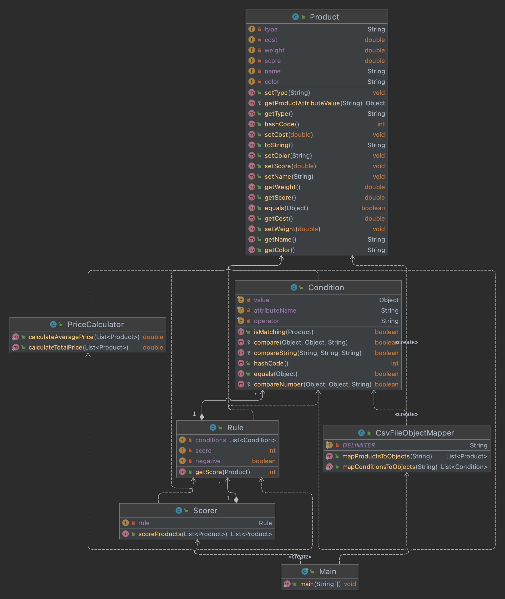

## Assumptions Made

* The salesman knows how to use a comand line interface
* The list of rules comes as a file
* The list of products comes as a file

## The UML Diagram



## How to Run the application on a command line

### Introduction
This guide will help you to run the application on a command line using Maven.

### Prerequisites

* Java JDK installed on your machine
* Maven installed on your machine
* A Java standalone application code

### Steps

Open the terminal/command prompt in the root directory of the application.

Run the following command to test and build the application using Maven:

```mvn clean install test```

This will download all the dependencies specified in the pom.xml file and build the application.

Once the build is successful, you can run the following command to execute the application:

```java -jar target/assingment-clx-1.0-SNAPSHOT.jar src/main/resources/products.csv src/main/resources/rules.csv false 100```

The application should have executed by now.

### Conclusion
By following these steps, you should be able to run the application on a command line using Maven. If you encounter any issues, refer to the Maven documentation for more information.


